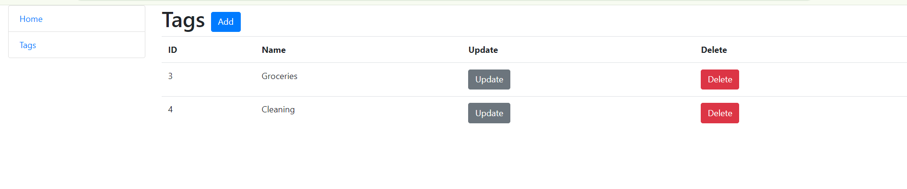
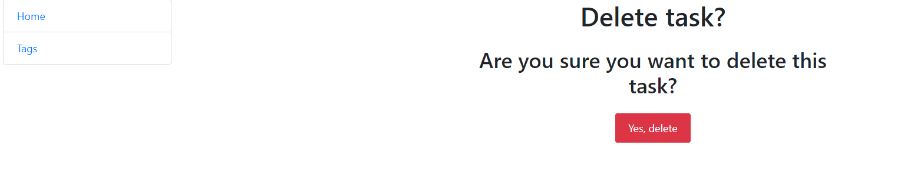
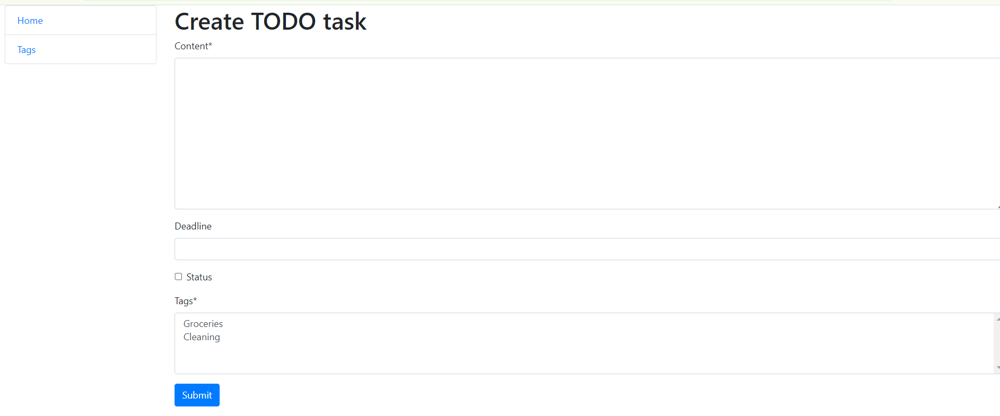

1.How to install proJect

Switch to develop branch

Then push <> code button and copy link

Open terminal and write git clone and paste your copied link

Enter to code redactor program and open this folder with it

Check venv, if it doesn't activated,

write python3 -m venv venv and then venv/Scripts/activate for windows,

for MacOS python3.9 -m venv venv and source venv/bin/activate

Write python manage.py runserver and push on http://127.0.0.1:8000/

Here is basic looks of pages
Home Page (existing tasks)
.png)

Tags 

Deletion page

Creation page

